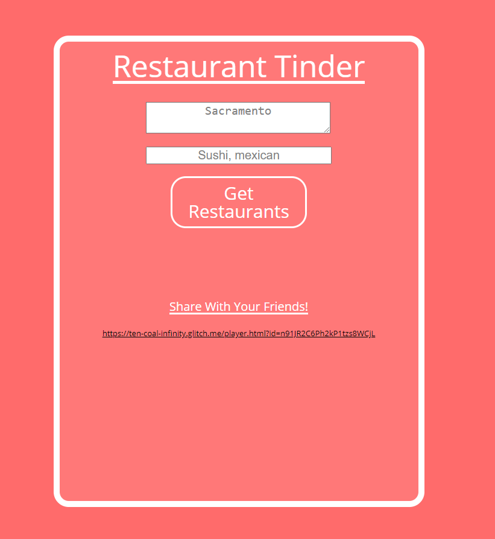
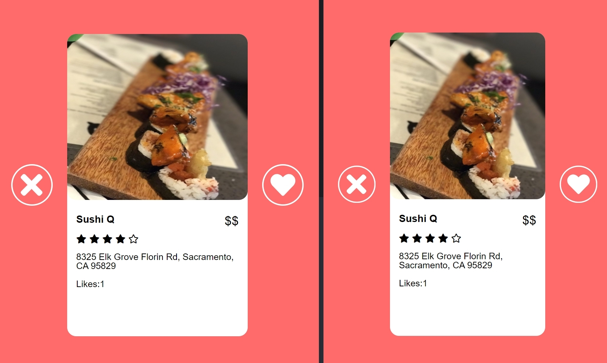
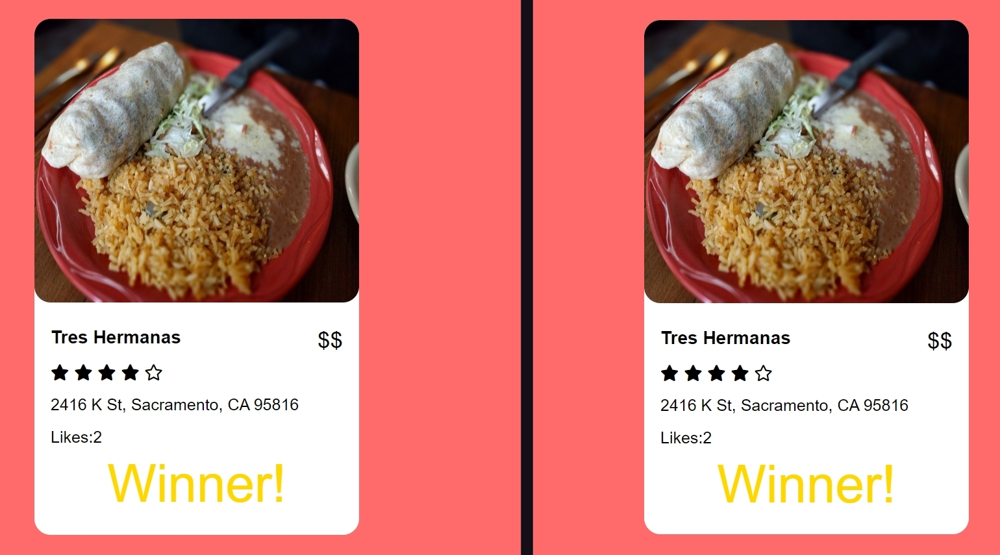

# Restaurant Tinder

ECS 162 Final Project: Restaurant Tinder. This is a Tinder-like app for restaurant choosing when friends can't decide what to do. Users will pick a restaurant food category they might be interested in going to, and the app will bring them restaurants in their area (within 25 miles). They will click on the left button if they don't like the restaurant and right if they like it until there is only 1 restaurant left.

## Preview
</img> </img> </img>

## Getting Started

This web app is meant to be run on Glitch.
- if the waiting page is not loading, do a refresh from the glitch terminal

## Technologies used

- [SQLite 3] - Storage management
- [Express] - Web app framework
- [Node.js] - Web app framework
- [fontawesome] - Icon set for buttons
- [HTTP] - Used to initialize server for WebSocket
- [WebSocket/ws] - Real time event handling
- node-fetch

## API

- [Yelp Fusion API] - Where we fetch our data/restaurants from

## Functional Specs

1. One player hosts the game. They go to the Home page, and hit the "Start new game" button. It brings up a link (including a random number) that they can message or email to the other players. It also brings up the search controls.

2. The other players receive the link, and click on it. This brings them to the Player page, which so far just says "Waiting...".

3. The host uses the search controls to get a panel of restaurants. There are two input boxes, one for location and the other for keywords. As they type, appropriate completions appear (eg. if they type Fil it should fill in Filipino). They can enter multiple keywords. When done, they hit "Get restaurants!"

4. Every player (including the host) sees the a single restaurant, with name, picture, Yelp rating, number of reviews, and price range, and number of times it has been chosen (initially zero). Optional: the user can click a button to see reviews.

5. The player clicks the left button for "yes" and the right for "no". On the laptop, swipe with the mouse/trackpad.

6. If the players all swipe right on one restaurant, it gets picked. If not, they cycle through the list again, with restaurants that nobody liked eliminated. If seeing how many of the other players liked a restaurant does not lead to picking one, the game defaults to choosing a random restaurant from those which were chosen the most.

## Design Specs

- [fontawesome] - star and heart icons come from here
- Two custom SVG icons are provided for the tinder desktop view, these are in the drive folder provided by the designer of the class, Emily.

## Technical Specs

1. The game proceeds in rounds (each of which requires an action from all players).

  - All players see the same restaurant in each round, and they all either pick or swipe. Then either a restaurant is chosen or we move on to the next round.
  - Restaurants still in play come up in a random permutation.
  - If there is not agreement after going through the restaurants three times, the Server picks based on the number of left-swipes each restaurant has accumulated, with ties broken randomly.

2. The result of each round is decided only after all players have chosen or swiped. We use Websockets for this.

3. The restaurants come from Yelp Fusion API. The user may type in the search and may autocomplete to a restaurant or category.

4. Detail information on the restaurants, including price range, rating and number of reviews, is visible while choosing.

## CRITICAL NOTES
1. For mobile view please use iPhone X.

2. Our game supports only 1 session at a time.

3. Refresh the whole app before each game to ensure databases are clear.
- Type "refresh" in the Glitch terminal

## Flow
1. Start a game as the host on **home.html**.
- **homeScript.js** includes all the script for **home.html**

2. Once the host clicks on **Start Game** button, another view will appear allowing the host to share a unique link to people who want to join

3. As a player, clicking on the link will send them to a waiting room in **player.html**.
- **playerScript.js** includes all the script for **player.html**

4. Once all players are in the waiting room, the host can enter a location and keywords to search for restaurants

5. The host clicks **Get Restaraunts**, the host will get redirected the player page and all players will start viewing restaurants one by one

6. The players will cycle through an array of 16 restaurants, and at the end of each round each restaurant with no likes gets removed from the array
- A round is defined as cycling through the current array of restaurants

7. There will be 3 rounds in total, then a winner will be chosen
- The winner is chosen when all players like a restaurant, else it is chosen randomly with the remaining restaurants

## Authors

- **Jose Miguel Batilando** jabatilando@ucdavis.edu
- **Sean Carnahan** sncarnahan@ucdavis.edu
- **Bryce Chung** btschung@ucdavis.edu
